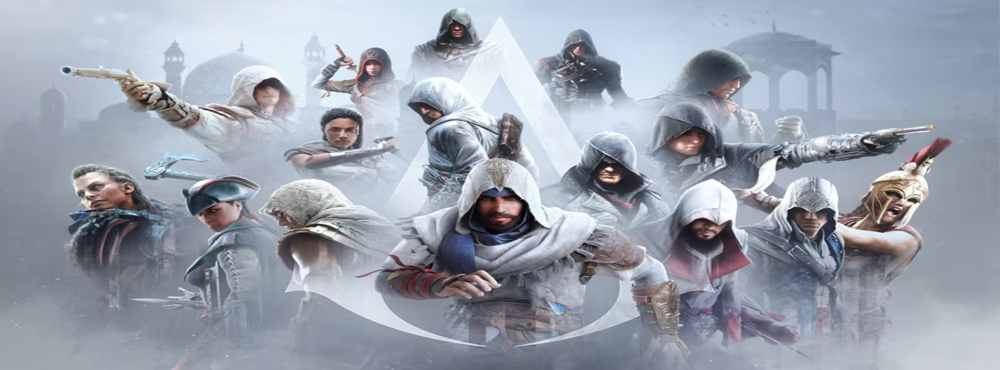

# Discover the Assassin's Creed Universe



<p align="center">
    
    
    
</p>

## ✨ About The Project

This project aims to introduce the universe of the Assassin's Creed video game series through a well-designed website. My goal is to provide an immersive and informative experience that will inspire visitors to play this iconic series.

## ℹ️ Pre-requisites

| Name    | Version     |
|---------|-------------|
| Bun     | 1.1.21 or + |

## 🛠️ How to run

- Install Bun dependencies

```shell
bun install
```

- Start in development mode

```shell
bun dev
```

## 📦 How to build

- Build using this command

```shell
bun build-app
```

- Then launch using Bun

```shell
bun ./build/index.js
```
